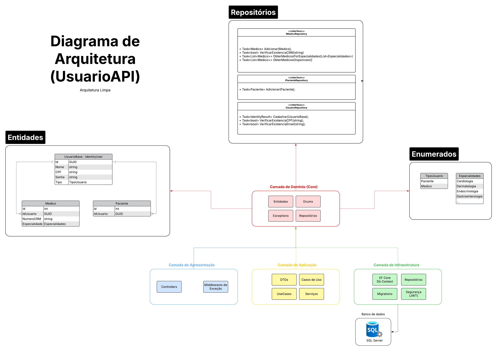
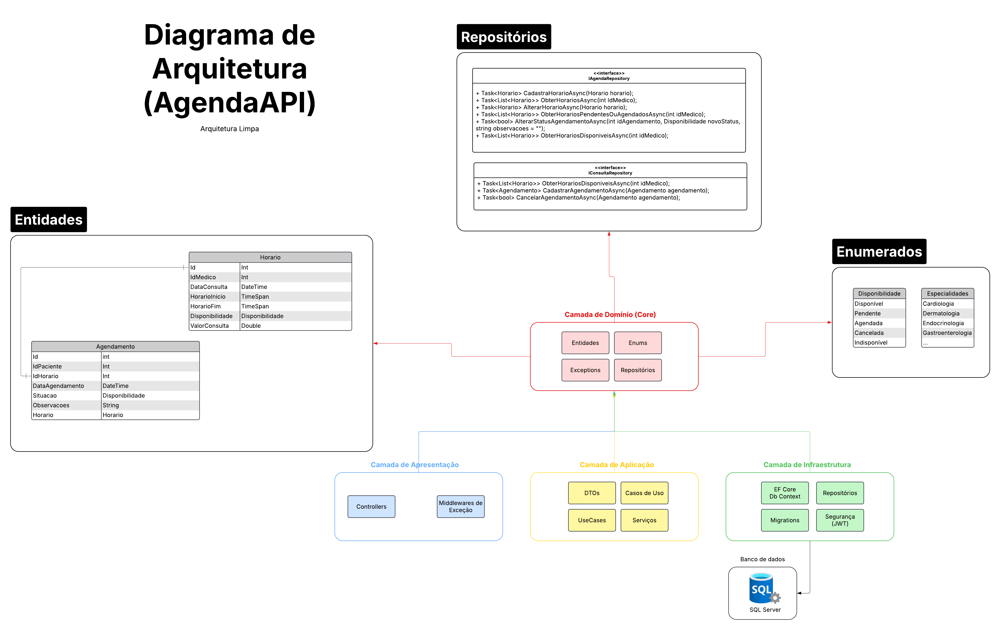

# HealthMed

**HealthMed** é um sistema de gerenciamento para clínicas médicas, desenvolvido em **.NET Core** e utilizando **Docker, RabbitMQ** e **SQL Server** como parte de sua arquitetura. O projeto implementa uma API RESTful para gerenciar usuários, agendas e envio de e-mails.

---

## 📽️ Vídeo de Apresentação

Conforme solicitado nos requisitos do Hackaton, segue o link da apresentação do projeto: https://youtu.be/O-rHQiVKr1o

---

## 📌 Tecnologias Utilizadas

- **C#** (.NET Core 8)
- **ASP.NET Core** (API REST)
- **Entity Framework Core**
- **SQL Server** (Banco de Dados Relacional)
- **RabbitMQ** (Mensageria para processamento assíncrono)
- **Docker** (Containerização dos serviços)
- **Docker Compose** (Orquestração dos containers)
- **xUnit** (Testes unitários)
- **EC2** (Amazon Web Services)
- **OAuth** (Autenticação para envio de e-mail)
- **JWT** (Geração de token para autenticação)
- **Scalar** (Documentação moderna open-source)
- **Identity** (Cadastro e gerenciamento de usuários)

---

## 📁 Estrutura do Projeto

O repositório contém os seguintes diretórios e arquivos principais:

```
HealthMed/
│── API/
│   ├── UsuarioAPI/         # API para gerenciamento de usuários
│   ├── AgendaAPI/          # API para agendamento de consultas
│── Worker/
│   ├── EmailWorker/        # Serviço de envio de e-mails via RabbitMQ
│── docker-compose.yml      # Arquivo de configuração do Docker Compose
│── Kubernetes              # Pasta com as configurações (deployments, services) do kubernetes
│── README.md               # Documentação do projeto
```

Cada serviço do sistema foi modularizado para garantir escalabilidade e organização.

## Diagrama de arquitetura da API de Usuários (Medicos e Pacientes)


## Diagrama de arquitetura da API de Agenda (Medicos e Pacientes)



---

##  🖥️ Importante!
A aplicação também estará hospedada nos serviços da Amazon (EC2) e poderá ser acessada durante uma semana.

URL da API de Usuários (Médicos e Pacientes): http://ec2-18-217-128-12.us-east-2.compute.amazonaws.com:8080/api-docs

URL da API de Agendamentos: http://ec2-18-217-128-12.us-east-2.compute.amazonaws.com:5002/api-docs

## 🚀 Como Executar o Projeto

### 1️⃣ Pré-requisitos
Antes de rodar o projeto, certifique-se de ter instalado:
- **Docker** e **Docker Compose**
- **SQL Server Management Studio** (Opcional, para gerenciar o banco de dados)

### 2️⃣ Configurar e Subir os Containers
Para iniciar todos os serviços, basta executar o seguinte comando no terminal, na raiz do projeto:

```sh
git clone https://github.com/maulru/HealthMed
cd HealthMed
docker-compose up -d --build
```

Isso irá criar e iniciar os seguintes serviços:
- **SQL Server** (porta `1433`)
- **RabbitMQ** (porta `5672` e interface de gerenciamento `15672`)
- **UsuarioAPI** (porta `8080`)
- **AgendaAPI** (porta `5002`)
- **EmailWorker** (processo em segundo plano para envio de e-mails)

Para visualizar os logs de um serviço específico, use:
```sh
docker logs -f usuarioapi
```

### 3️⃣ Acessando os Serviços
Após iniciar os containers, os serviços podem ser acessados em:
- **UsuarioAPI** → `http://localhost:8080/api-docs`
- **AgendaAPI** → `http://localhost:5002/api-docs`
- **RabbitMQ Management** → `http://localhost:15672` (Usuário: `guest`, Senha: `guest`)

### 4️⃣ Parar os Containers
Para interromper a execução dos serviços, utilize:
```sh
docker-compose down
```

---

## 📌 Configuração do Banco de Dados

O SQL Server está configurado para rodar em um container. As credenciais padrão são:
```
Servidor: localhost,1433
Usuário: sa
Senha: M@sterk3y
```
Caso precise se conectar ao banco via SSMS ou outra ferramenta, use essas credenciais.

---

## 📩 Configuração do EmailWorker

O **EmailWorker** escuta mensagens da fila do **RabbitMQ** para processar envios de e-mail. Certifique-se de que o serviço RabbitMQ está rodando antes de iniciar o worker.

--

## ✅ Testes Automatizados

O projeto inclui testes unitários para validar as principais regras de negócio. Para executar os testes, use:
```sh
dotnet test
```

---

## 👨‍💻 Contribuição

Ficou interessado no projeto? Sinta-se à vontade para contribuir!

1. Faça um **fork** do repositório
2. Crie uma **branch** com sua funcionalidade (`git checkout -b minha-feature`)
3. Commit suas alterações (`git commit -m 'Adicionando nova funcionalidade'`)
4. Faça um **push** para a branch (`git push origin minha-feature`)
5. Abra um **Pull Request**

---

## 📄 Licença

Este projeto é licenciado sob a **MIT License** - sinta-se à vontade para utilizá-lo e modificá-lo conforme necessário.


